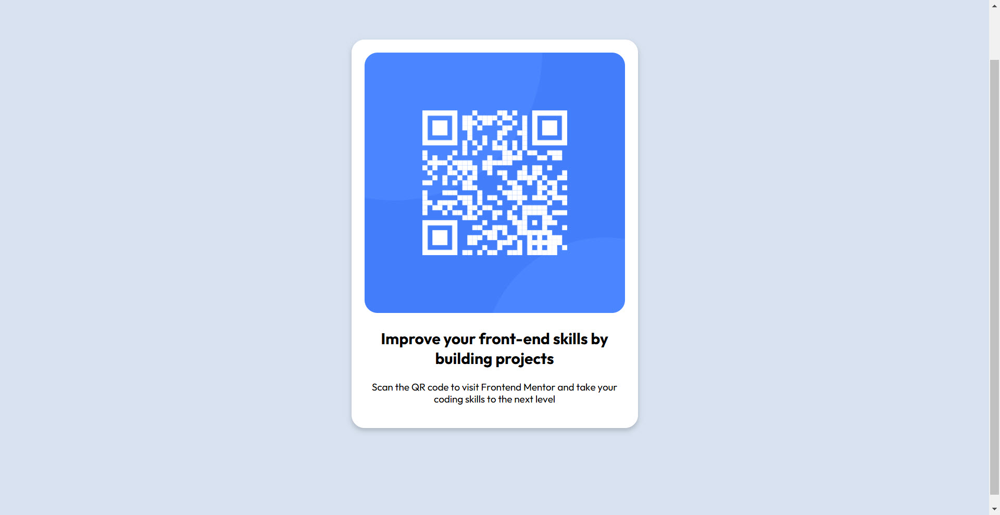

# Frontend Mentor - QR code component solution

This is a solution to the [QR code component challenge on Frontend Mentor](https://www.frontendmentor.io/challenges/qr-code-component-iux_sIO_H). Frontend Mentor challenges help you improve your coding skills by building realistic projects.

## Table of contents

- [Overview](#overview)
  - [Screenshot](#screenshot)
  - [Links](#links)
- [My process](#my-process)
  - [Built with](#built-with)
  - [What I learned](#what-i-learned)
  - [Continued development](#continued-development)
  - [Useful resources](#useful-resources)
- [Author](#author)
- [Acknowledgments](#acknowledgments)

**Note: Delete this note and update the table of contents based on what sections you keep.**

## Overview

### Screenshot

### Links

- Solution URL: [Add solution URL here](https://your-solution-url.com)
- Live Site URL: [Add live site URL here](https://your-live-site-url.com)

## My process

### Built with

- Semantic HTML5 markup
- CSS custom properties
- Flexbox
- Visual Studio Code

### What I learned

I used basic CSS properties to customize the look.

### Continued development

I am looking to practice and learn CSS. I am a backend developer and CSS is definetly my weakest part of my skills.

### Useful resources

- [Udemy](https://www.udemy.com) - I have been taken 100 Days of code class on Udemy. Angela Yu does a great job going over CSS.

## Author

- Frontend Mentor - [@yourusername](https://www.frontendmentor.io/profile/nhaydon70)
- Twitter - [@signia70](https://www.twitter.com/signia70)

## Acknowledgments

Shout out to Angela Yu and helping me learn Python and CSS(and many other things!)
